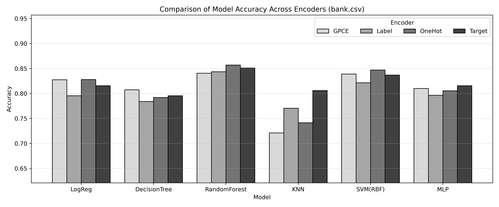
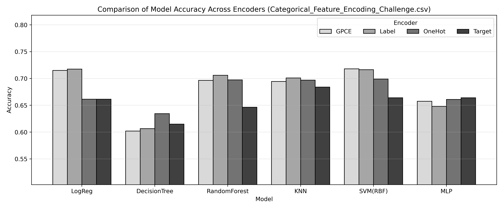
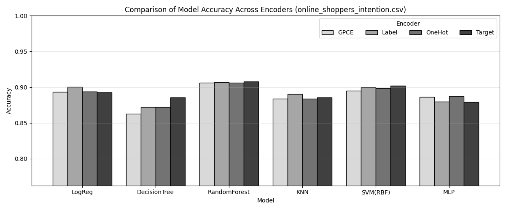
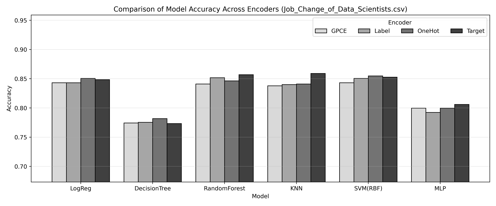
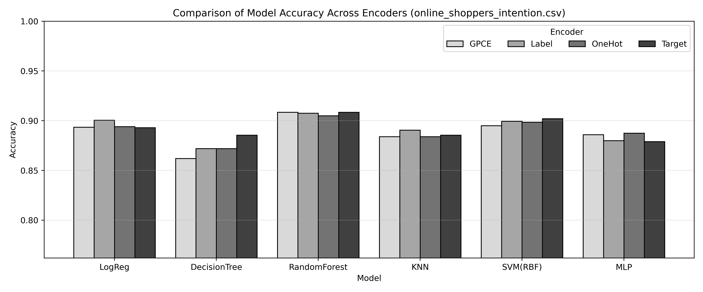

# GPC Encoder (Geometry Preserving Categorical Encoder)

## Overview

The **Geometry Preserving Categorical Encoder (GPCE)** is a novel categorical data encoding method designed to overcome the fundamental limitations of commonly used encoding techniques in machine learning and deep learning. GPCE provides a **unified, model-agnostic solution** that is robust across datasets, feature cardinalities, and learning algorithms.

This repository contains the full implementation of GPCE, along with experimental code used to evaluate its performance against widely adopted categorical encoders.

---

## Requirements

- **Python 3.11.4**
- See `requirements.txt` for full dependency details

---

## Motivation

Most machine learning models require numerical inputs, making categorical encoding a crucial preprocessing step. However, traditional encoding methods each suffer from inherent weaknesses:

### Limitations of Existing Encoders

- **One-Hot Encoding**
  - Leads to **dimensional explosion** as the number of categories increases
  - Causes inefficient computation and increased risk of overfitting for high-cardinality features

- **Label Encoding**
  - Assigns arbitrary numerical order to categories
  - Introduces **artificial ordinal relationships** that do not exist in the original data
  - Can negatively affect linear and distance-based models

- **Target Mean Encoding**
  - Uses target-label statistics during encoding
  - Highly susceptible to **data leakage**
  - Produces unstable representations for rare categories or small datasets

No single traditional method successfully resolves all of these issues at once. GPCE is designed to address this gap.

---

## Key Idea Behind GPCE

GPCE is based on a **geometric interpretation of categorical variables**. Instead of treating categories as ordered values or sparse indicators, GPCE represents each category as a vector with the following properties:

- All category vectors are **equally distant from one another**
- All vectors lie on a **hypersphere with a fixed radius**
- No artificial ordering or hierarchy is introduced

This geometric symmetry ensures that categories are treated as **equally distinct entities**, faithfully reflecting their categorical nature.

---

## Core Design Principles

GPCE is built upon three core principles:

1. **Order Invariance**  
   Categories are encoded without introducing any artificial ordinal relationships.

2. **Dimensional Efficiency**  
   High-cardinality categorical features are encoded without excessive feature expansion.

3. **Leakage-Free Encoding**  
   The encoding process is completely independent of target labels and uses only training data.

---

## Methodology

For each categorical feature:

1. Unique categories are identified **from the training data only**.
2. Each category is initially represented as a standard basis vector in a K-dimensional space.
3. These vectors are centered and scaled so that all category vectors:
   - Have equal norm
   - Are symmetrically distributed around the origin
4. A **random projection** is applied to reduce dimensionality from K to D while approximately preserving pairwise distances, based on the **Johnson–Lindenstrauss lemma**.
5. The projected vectors are re-normalized and expanded into D numerical features.
6. Unseen categories in test data are handled using a robust fallback strategy.

The resulting encoded features are concatenated with existing numerical features and passed directly to machine learning models.

---

## Advantages of GPCE

- Eliminates artificial ordering
- Prevents dimensional explosion
- Completely avoids data leakage
- Stable across datasets, models, and feature cardinalities
- Requires no feature-wise encoder selection
- Works as a strong **general-purpose categorical encoder**

While GPCE may not always achieve the single highest accuracy in every setting, it consistently performs near the top and rarely exhibits severe performance degradation.

---

## Experimental Evaluation

GPCE is evaluated against:
- Label Encoding
- One-Hot Encoding
- Target Mean Encoding

Across multiple models, including:
- Logistic Regression
- Decision Trees
- Random Forests
- K-Nearest Neighbors
- Support Vector Machines
- Multi-Layer Perceptrons

Results demonstrate that GPCE achieves **high predictive stability and competitive accuracy** across diverse learning algorithms.

---

## Experimental Results

The following figures compare model accuracy across different categorical encoding methods,
including GPCE, Label Encoding, One-Hot Encoding, and Target Mean Encoding.
Each figure corresponds to a different dataset or experimental setting.

### Figure 1. Model Accuracy Comparison (Dataset 1)

### Figure 2. Model Accuracy Comparison (Dataset 2)

### Figure 3. Model Accuracy Comparison (Dataset 3)

### Figure 4. Model Accuracy Comparison (Dataset 4)

### Figure 5. Model Accuracy Comparison (Dataset 5)

Across all experiments, GPCE demonstrates strong and stable performance.
While it does not always achieve the highest accuracy in every setting,
it consistently performs better than most baseline encoders and avoids
severe performance degradation.

---

## Sample Dataset

The experiments in this repository use the **Bank Marketing Dataset** from Kaggle:

🔗 https://www.kaggle.com/datasets/janiobachmann/bank-marketing-dataset

This dataset contains multiple high-cardinality categorical features and serves as a realistic benchmark for evaluating categorical encoding methods.

---

## License

This project is intended for research and educational use.